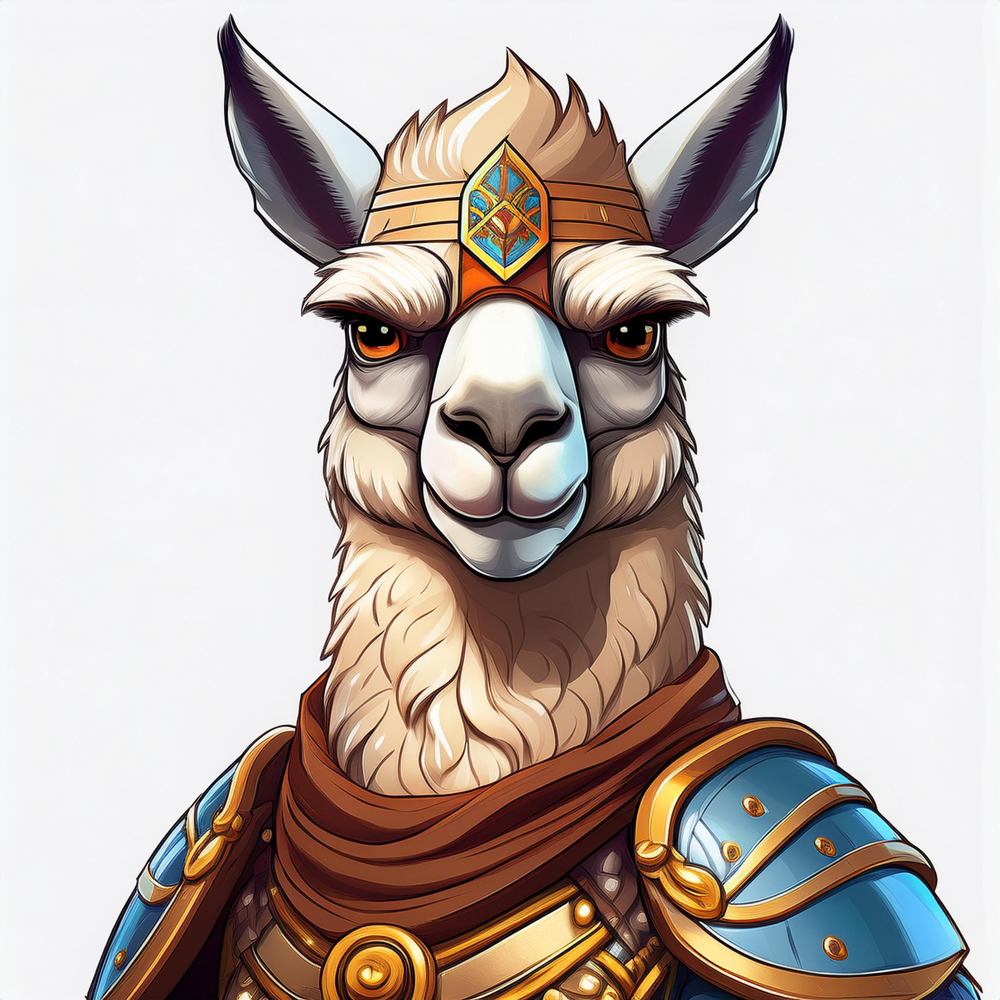
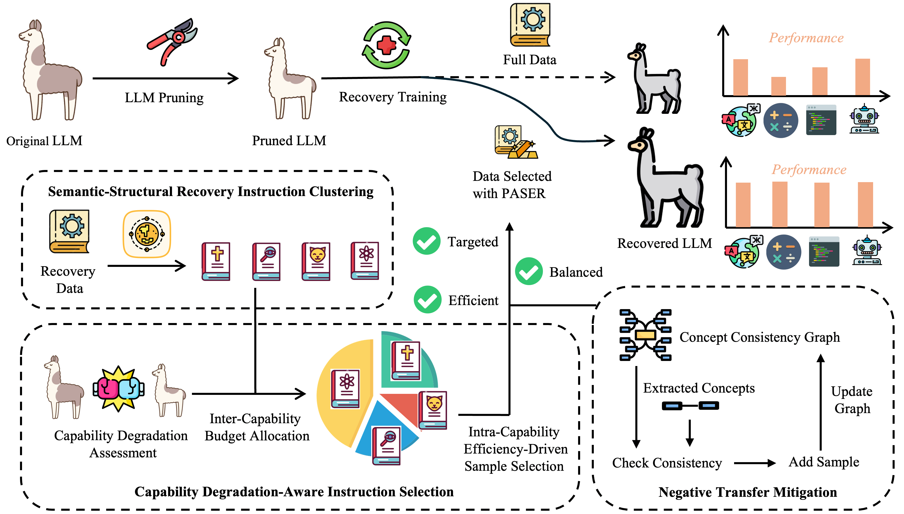

# PASER   <!-- Adjusted icon size -->: Post-Training Data Selection for Efficient Pruned Large Language Model Recovery

*This icon, created with [Adobe Express](https://www.adobe.com/express/), symbolizes the Almighty Warrior LLaMA, indicating that our proposed PASER method can recover the pruned LLaMA models to full-capability large language models.*

## Framework

The overall framework of PASER is shown above for facilitating understanding.

## Installation

1. Create and activate an Anaconda virtual environment:
   ```bash
   conda create -n paser_env python=3v.8
   conda activate paser_env
   ```

2. Install the required packages:
   You have two options:

   a. Install packages individually:
   ```bash
   pip install torch transformers datasets scikit-learn numpy tqdm sentence-transformers networkx rake-nltk wandb matplotlib seaborn
   pip install git+https://github.com/EleutherAI/lm-evaluation-harness.git
   ```

   b. Install from the provided requirements.txt file:
   ```bash
   pip install -r requirements.txt
   ```

## Training

To run PASER for data selection and model training:
   ```bash
    python main.py --base_model "meta-llama/Llama-2-7b-hf" 
    --prune_model "./pruned_llama_7b" 
    --data_path "yahma/alpaca-cleaned" 
    --output_dir "./output" 
    --max_selected_data 20000 
    --num_epochs 3 
    --learning_rate 3e-4 
    --batch_size 128 
    --micro_batch_size 4
   ```


## Evaluation

To evaluate the model on downstream tasks and perplexity:
   ```bash
    python evaluate.py --model "./output/final_model" 
    --tasks "boolq,piqa,hellaswag,winogrande,arc_easy,arc_challenge,openbookqa" 
    --device cuda
   ```


This will output results for perplexity on WikiText-2 and performance on the specified tasks.
